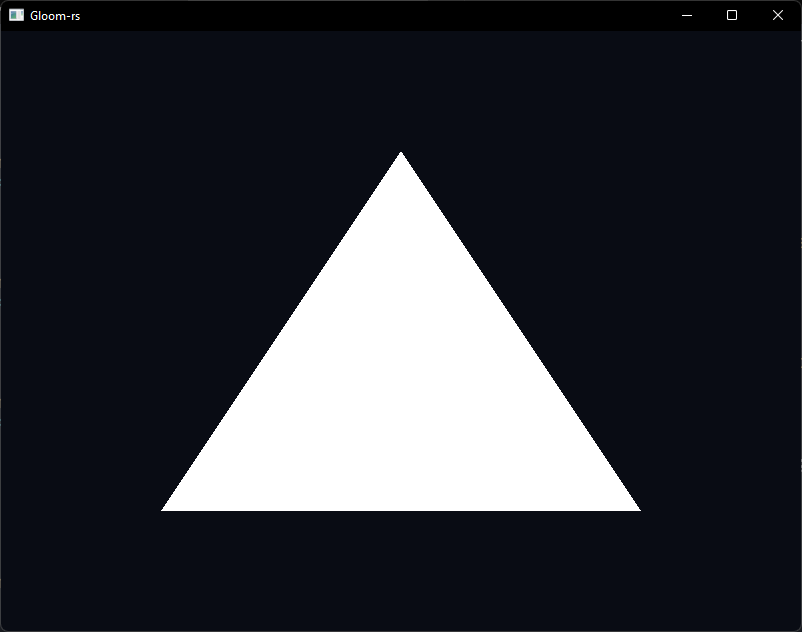
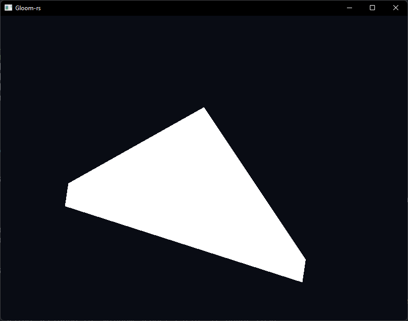
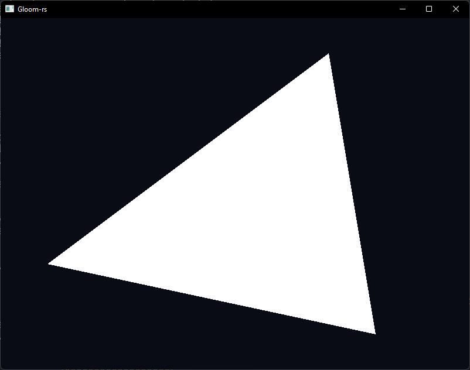
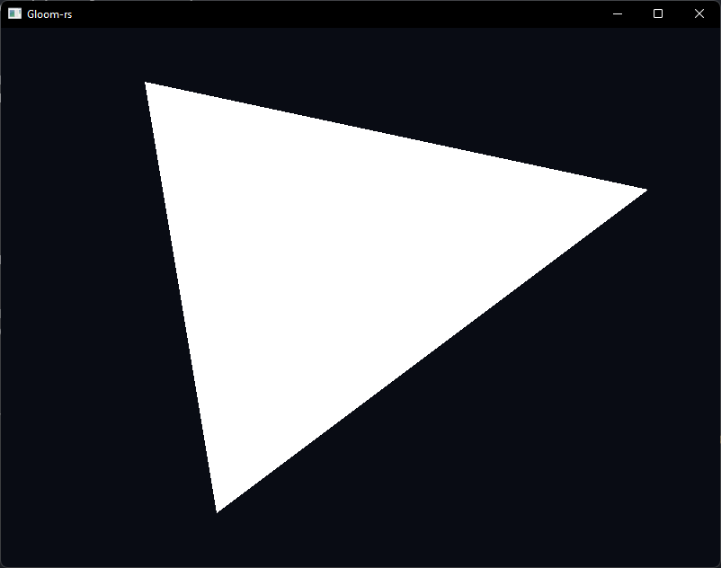
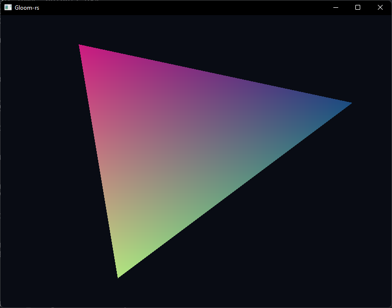
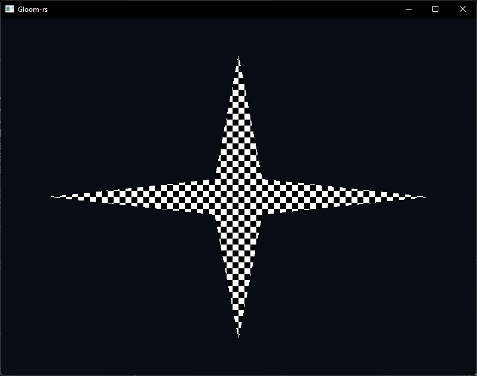

# Task 1

## c)

See the corresponding figure.

# Task 2

## a)

This phenomenon is called clipping. OpenGL has a "ClipBox" around the origin from -1 to 1
along each axis, making a 2x2x2 cube. When a shape exceeds this cube, it will be "clipped"
such that it fits inside the cube. Since two of the vertices in the triangle are outside of
this box ($v_0$ and $v_2$), we see this clipping behaviour on two of the corners of the triangle.
Clipping is a performance optimization which avoids rendering shapes that are outside of the camera's view.

## b)

Swapping two of the indices causes the triangle to become invisible. This happens because only
one of the triangle's faces is drawn (think of the triangle as a 2D triangle in 3D space). The
order in which the vertices are drawn determine which way the triangle is "facing". If the
vertices are drawn counter-clockwise, the triangle is facing towards the camera. If they are drawn
clockwise, then the triangle will be facing away from the camera.

## c)

1. The depth buffer needs to be cleared each frame, otherwise the depth of each fragment would
be compared to the fragments of the previous frame, which does not work in a changing scene.
1. Shapes that are "overlapping" and are behind each other can cause the fragment shader to be
executed multiple times for the same pixel (assuming early depth testing is disabled).
1. These are called vertex and fragment shaders. A vertex shader is responsible for performing
transformations on each vertex in a draw call, and is therefore executed for each vertex. The
fragment shader is responsible for coloring the "potential pixels" of a rasterized shape, and
is executed for each "pixel".
1. This is because a 3D object often consists of multiple primitive shapes (e.g. triangles)
that have multiple vertices in common. Therefore we can save memory by not duplicating vertices,
but rather specify which of them should be used for drawing (and in what order).
1. If you for example have a buffer that contains both vertex coordinates and texture coordinates,
you can use this pointer as an offset into the buffer when specifying the location of the
texture coordinates. Together with the `stride` argument of `gl::VertexAttribPointer()`, you can
use one buffer for both vertex coordinates and texture coordinates.

## d)

To flip the scene vertically and horizontally I negated each component of the position of each vertex.
To color the triangle I used the vertices' x and y positions as inputs to the fragment shader to make
a gradient effect.

# Task 3

## a)

See the corresponding figure for my implementation.

