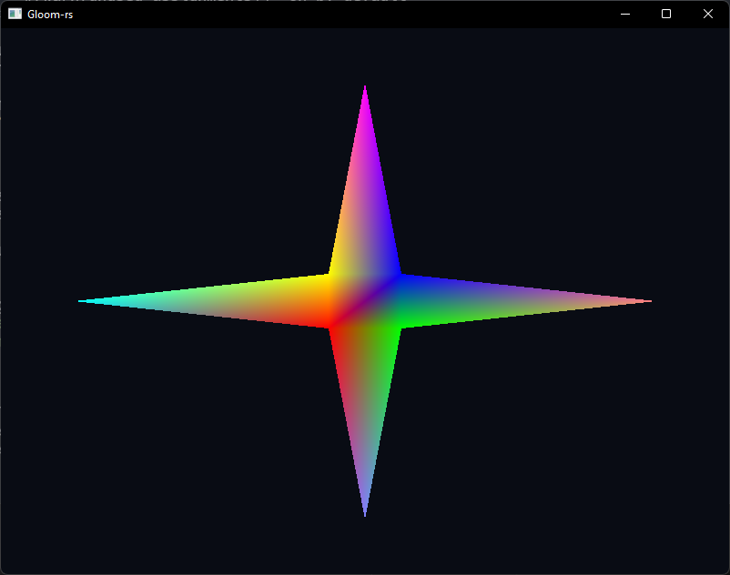
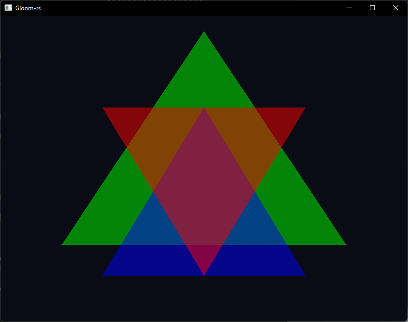

# Task 1

## b)

For the fragments between vertices of different colors OpenGL interpolates the color value.
E.g. between a vertex with the color red and a vertex with the color blue, the fragments in
between will gradually transition from red to blue.

# Task 2

## b)

i)  The final blended color is different based on wich order the colors are blended. This
because each time two colors are blended, they are multiplied by $Alpha_{Source}$ and
$(1 - Alpha_{Source})$. The foremost triangle will only have its colors blended once, while
the two other triangles will be blended twice.
i)  This causes the color to not be blended for the triangles who are drawn after others,
but are behind them in 3D space. This is because the depth testing will discrd the fragments
where blending "should have occured", since the depth buffer shows that a shape is in front.

# Task 3

## b)

* Value $a$: Scales the x-axis
* Value $b$: Shear on x-axis
* Value $c$: Translation along x-axis
* Value $d$: Shear on y-axis
* Value $e$: Scales the y-axis
* Value $f$: Translation along y-axis

## c)

Rotation is a combined transformation of scaling and shearing, and since we performed the
transformations one at a time it can't be a rotation.

# Task 4

## c)

The keybinds I have chosen are the same as the ones that are used to automatically test
the code: WASD for movement in the x and z-directions, LSHIFT and SPACE for movement in
the y-direction, and the arrow keys for rotation.
