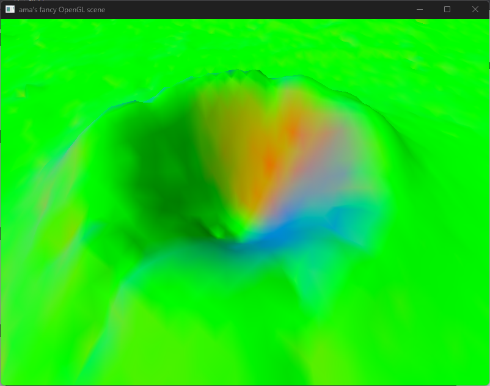
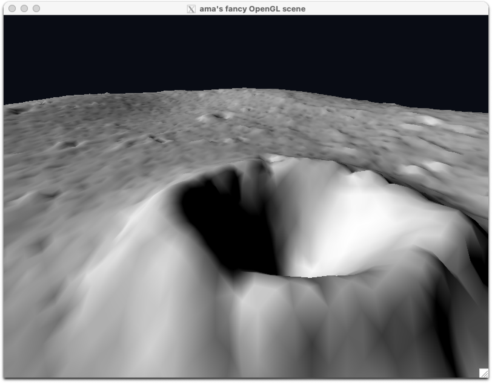
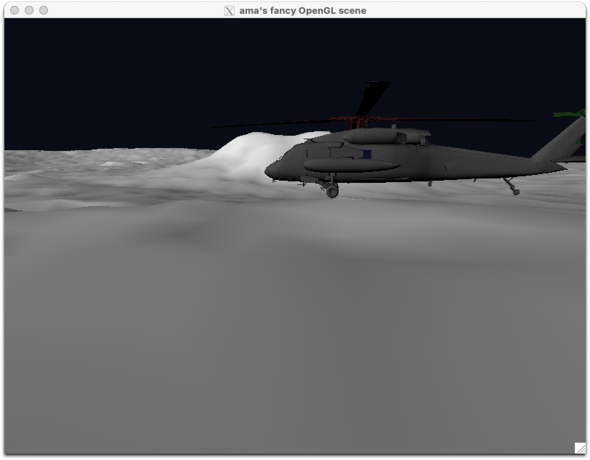
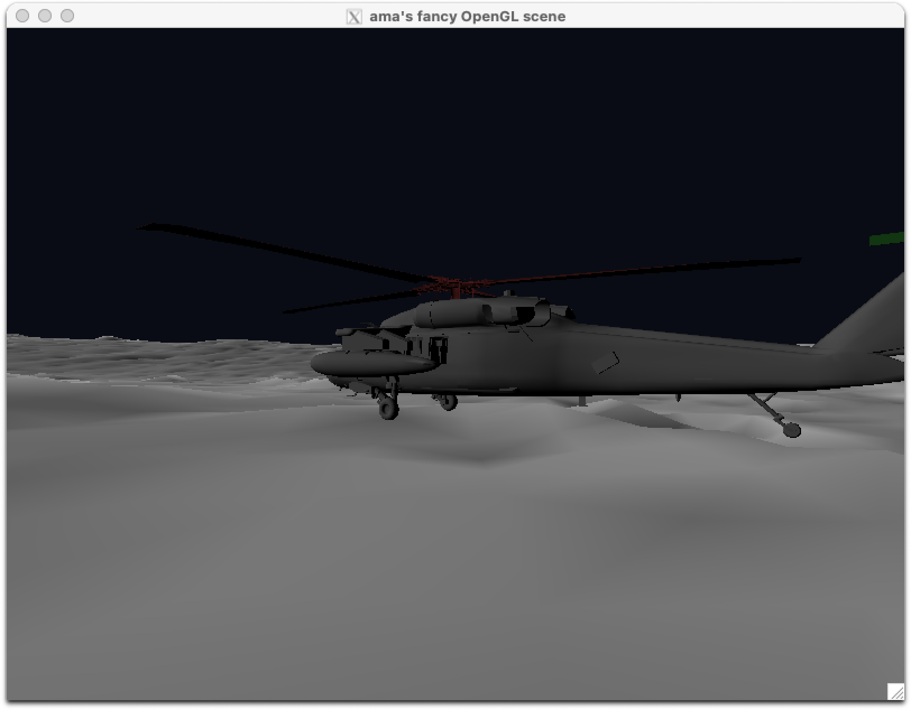
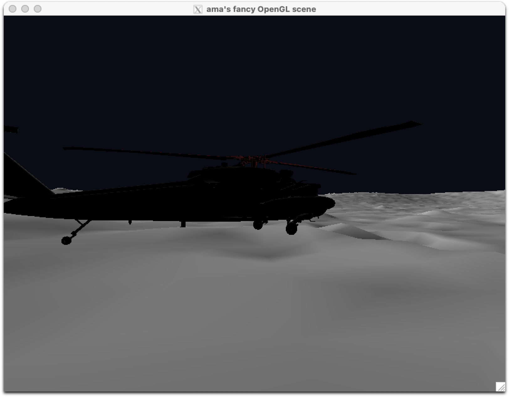
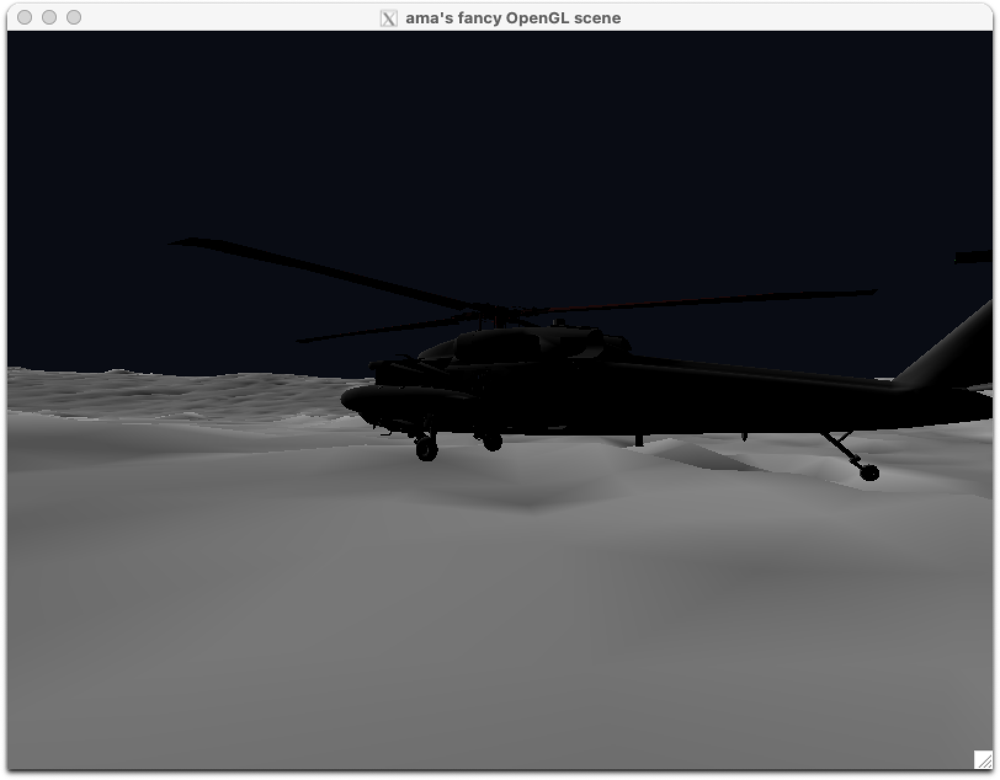
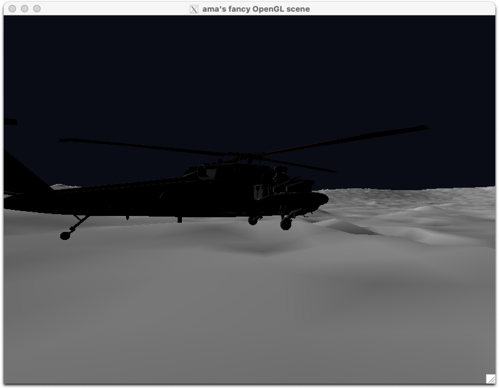
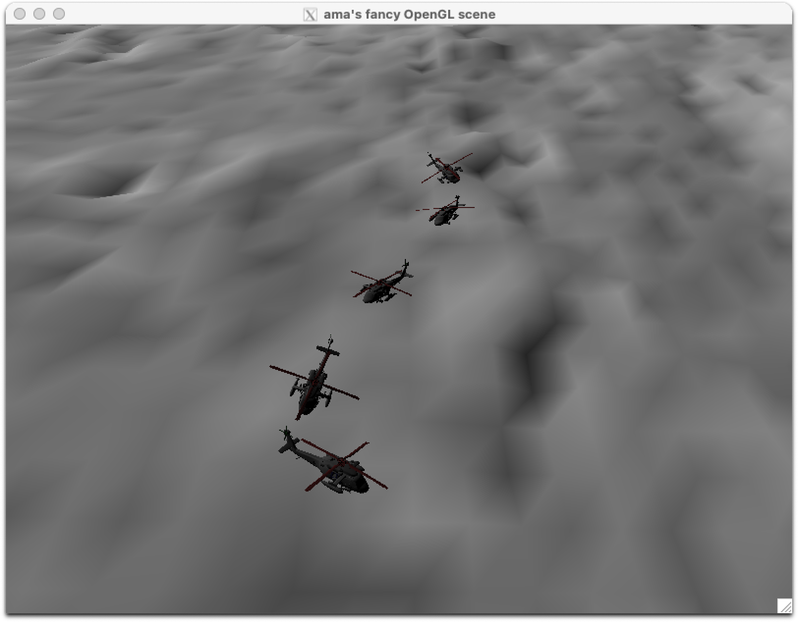

# Task 1

## c)

See the corresponding figure.

## d)

See the corresponding figure.

# Task 2

## c)

See the corresponding figure.

# Task 5

## a)

See the corresponding figures.

## c)

See the corresponding figures.

# Task 6

## a)

See the corresponding figure.

